# ANALYSIS — cuad-jev-bench

**run_id:** `cuad-jev-2026-09-20`  
**model:** `jev-1.13.0` (requested `jev-latest`)  
**criterion (exact):** `more relevant to the requested contract category`  
**repository:** [maybern-tripp-smith/cuad-jev-bench](https://github.com/maybern-tripp-smith/cuad-jev-bench)  
**pages:** [https://maybern-tripp-smith.github.io/cuad-jev-bench/](https://maybern-tripp-smith.github.io/cuad-jev-bench/)

Companion gate report: [`REPORT.md`](REPORT.md). Machine-readable results: [`results/gates.json`](results/gates.json), [`results/diagnostics.json`](results/diagnostics.json). Figure captions: [`results/figures/CAPTIONS.md`](results/figures/CAPTIONS.md).

---

## Abstract

Human annotations of contract clauses are a natural but incomplete label for *relevance to a requested legal category*: the same category string can apply to sparse spans in long commercial agreements, while nearby paragraphs share vocabulary without being on-point. This note reports a pre-registered evaluation of TypeSafe/Jev on the open CUAD corpus (Atticus Project, CC BY 4.0) under a frozen pairwise Choice and graded Score protocol. Labels are CUAD human span annotations only; the judge is never used to construct gold.

On 40 rule-built certain pairs (Stratum A), Choice inversion is 0.000 (binomial standard error 0.000). On 200 same-contract BM25 hard-negative pairs (Stratum B), inversion is 0.320 (s.e. 0.033) with mean Brier score 0.250 (s.e. 0.026) and expected calibration error (ECE) 0.324. For 100 (contract, category) candidate-ranking queries, expected Score yields gold mean reciprocal rank (MRR) 0.917 (s.e. 0.021) versus BM25 MRR 0.469 (s.e. 0.041) and chance MRR 0.298 (s.e. 0.002). Gate 4 is interpreted as a **construct-validity** contrast: under the same category query, mean expected Score on gold spans (2.685, s.e. 0.062) exceeds the mean on BM25 hard-negatives (0.555, s.e. 0.027), a gap of 2.130 (s.e. 0.067). Name/date ablation leaves Stratum A inversion unchanged (Δ = 0.000). Gate 7 cites published DeBERTa-xlarge extractive metrics as a literature difficulty anchor only; this bench does not re-run DeBERTa and uses a different task shape. Total Jev spend is approximately $0.043; overall p50 latency is 182 ms.

## Contributions

1. A FedLock/fedjev-style open-data Jev bench for **contract-clause relevance** with pre-registered gates, frozen gold, cost/latency artifacts, and expanded diagnostic figures.
2. Design A: certain cross-contract negatives (Stratum A) plus same-contract BM25 hard-negatives (Stratum B), dual-order Choice.
3. Candidate-score lite: BM25 top-10 re-ranked by Jev Score levels, with gold injection logged when needed for measurable rank.
4. An explicit construct-validity gate (Gate 4): gold versus non-gold under the same category query, reported with standard errors—not a product claim about retrieval quality alone.
5. An honest Gate 7: literature extractive DeBERTa numbers for difficulty narrative only; not a re-run and not a like-for-like task comparison.

## 1. Introduction

Empirical work on contract understanding often treats extractive span overlap or retrieval hit-rate as sufficient evidence that a model “understands” a category. Those measures conflate two constructs:

1. **Annotation / location measure** — whether a system recovers the same character spans humans marked for a CUAD category.
2. **Relevance measure** — whether, given a category description, a text unit is judged more on-point than a hard negative drawn from the same document or from a contract lacking that category.

The evaluation question studied here is therefore:

> Under a fixed pairwise criterion and graded Score levels, does Jev recover (i) obvious gold-versus-certain-negative orderings, (ii) discrimination against BM25 hard-negatives with reported calibration, and (iii) a Score ordering in which gold spans sit above hard-negatives under the *same* category query—evidence of construct validity for the relevance Score axis?

Gates were registered before any Jev output. Pass/fail applies to Gates 1, 3 (signal), 4, and 6; Gates 2, 5, and 7 are report-only.

## 2. Data

| Corpus | Path | Role |
|--------|------|------|
| CUAD v1 contracts | `data/raw/CUAD_v1/CUAD_v1.json` | Source text (CC BY 4.0) |
| Paragraph chunks | `data/clean/paragraphs.jsonl` | 21,598 units |
| Human spans | `data/labels/spans.jsonl` | 13,823 annotations across 41 categories |
| Frozen gold | `data/pairs/gold_pairs.jsonl` | Strata A/B + candidate queries |

**Labels.** CUAD human spans only. Category prompts use CUAD question “Details” text.

**Exclusions / design choices (pre-registered).** No post-hoc dropping of inverted Stratum A pairs. Candidate scoring injects gold into BM25 top-10 when absent so rank is measurable; injection is logged and is not counted as BM25 retrieval success.

**Gold freeze.** Pairs were written before the first live call (REPORT mtime 17:30:16 EDT; gold mtime 17:32:37 EDT; scoring after freeze).

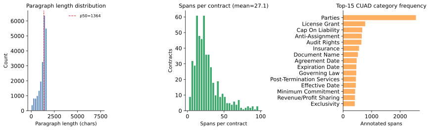

*Figure. Corpus shape for CUAD v1 after paragraph chunking: character-length distribution of paragraphs; spans per contract; top-15 category frequencies among human annotations. Full caption: [`results/figures/CAPTIONS.md`](results/figures/CAPTIONS.md).*

## 3. Method

**Choice (primary for Gates 1–2, 6).** Criterion string (exact): `more relevant to the requested contract category`. Both presentation orders; probabilities mapped to the gold side and averaged. Inversion = averaged winner ≠ gold. Meta stripping via `scripts/strip_meta.py` for main tables; Gate 6 re-runs Stratum A with names/dates left in.

**Score (Gates 3–4).** Levels `irrelevant / weakly relevant / relevant / highly relevant`. Expected score = Σ i·p_i with i ∈ {0,1,2,3}.

**Strata.**

| Stratum | n | Construction |
|---------|--:|--------------|
| A | 40 | Gold span vs paragraph from a contract with no annotation for that category |
| B | 200 | Gold span vs BM25 hard-neg in the same contract (seed 20260920) |
| Candidates | 100 queries × ≤10 paras | BM25 top-10; gold injected if absent |

**Uncertainty.** Inversion and order-flip rates: binomial standard error √[p(1−p)/n]. Means and Brier: s.e. = sample sd/√n (bootstrap s.e. retained in `gates.json` / `accuracy_summary.json` where previously computed). Gate 4 gap s.e. = √(se_gold² + se_neg²). Calibration: ten equal-width bins on p(gold); ECE as the probability-weighted absolute gap between confidence and accuracy.

## 4. Pre-registered gates and results

| # | Gate | Pass line | Result |
|---|------|-----------|--------|
| 1 | Easy-pair inversion (A) | ≤ 0.05 | **PASS** — 0.000 (n=40, s.e. 0.000) |
| 2 | Labeled inversion + Brier (B) | report | inv=0.320 (s.e. 0.033); Brier=0.250 (s.e. 0.026); mean p(gold)=0.676 (n=200) |
| 3 | Candidate Score vs BM25 | Jev MRR > BM25 MRR | **PASS_SIGNAL** — MRR 0.917 (s.e. 0.021) > 0.469 (s.e. 0.041); chance 0.298 |
| 4 | Construct validity | mean Score(gold) > mean Score(neg) | **PASS** — 2.685 (s.e. 0.062) > 0.555 (s.e. 0.027); gap 2.130 (s.e. 0.067) |
| 5 | Secondary calibration | report | Brier=0.250 (s.e. 0.026); ECE=0.324 (n=200) |
| 6 | Name/meta ablation | Δ inv ≤ 0.05 | **PASS** — Δ=0.000 |
| 7 | Literature DeBERTa | report only | AUPR 47.8; P@80R 44.0; P@90R 17.8 (Hendrycks et al. 2021). **Not re-run.** |

### 4.1 Inversion by stratum

| Stratum | n | inverted | inversion (s.e.) | mean p(gold) | mean Brier (s.e.) | order-flip |
|---------|--:|--------:|-----------------:|-------------:|------------------:|-----------:|
| A certain | 40 | 0 | 0.000 (0.000) | 0.976 | 0.007 (0.004) | 0.000 |
| B labeled | 200 | 64 | 0.320 (0.033) | 0.676 | 0.250 (0.026) | 0.075 |

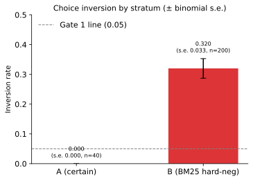

*Figure. Choice inversion rates ± binomial standard error for Stratum A (n=40) and Stratum B (n=200). Dashed line: Gate 1 threshold (0.05).*

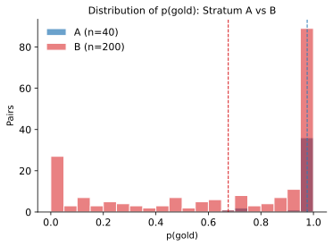

*Figure. Distribution of Choice p(gold) under stripped meta for Stratum A versus Stratum B. The leftward shift in B is consistent with a harder discrimination setting under BM25 hard-negatives.*

### 4.2 Calibration (Gate 5)

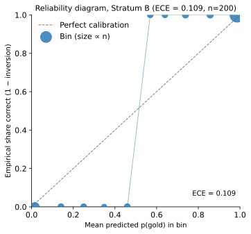

*Figure. Reliability diagram for Stratum B p(gold). Marker area is proportional to bin count. ECE = 0.324 (n=200), indicating overconfidence relative to binary correctness; no post-hoc temperature fitting is applied.*

### 4.3 Candidate ranking (Gate 3)

| Estimator | MRR (s.e.) | R@1 (s.e.) | R@3 (s.e.) | R@5 (s.e.) |
|-----------|-----------:|-----------:|-----------:|-----------:|
| Jev Score | 0.917 (0.021) | 0.86 (0.035) | 0.97 (0.017) | 0.99 (0.010) |
| BM25 | 0.469 (0.041) | 0.35 (0.047) | 0.51 (0.050) | 0.57 (0.051) |
| Chance | 0.298 (0.002) | 0.10* | 0.30* | 0.50* |

\*Chance Recall@k among ten candidates is k/10 (deterministic benchmark).

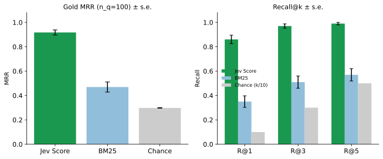

*Figure. Left: gold MRR under Jev Score, BM25, and chance (n_q=100) ± standard error. Right: Recall@{1,3,5} for Jev and BM25 (± s.e.) against chance k/10.*

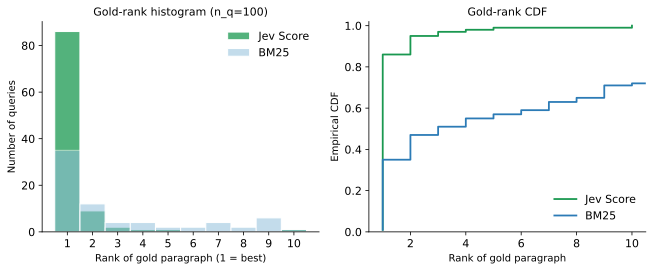

*Figure. Histogram and empirical CDF of the rank of the gold paragraph under Jev Score versus BM25. Mass near rank 1 under Jev indicates recovery of annotated spans above the lexical baseline.*

### 4.4 Construct validity (Gate 4)

Gate 4 asks whether the Score axis separates gold from non-gold **under the same category query**—a construct-validity contrast, not a claim that Score alone solves extractive QA.

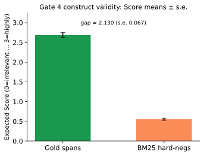

*Figure. Mean expected Score on gold CUAD spans (n=100) versus BM25 hard-negative paragraphs (n=882), ± standard error of the mean. Gap = 2.130 (s.e. 0.067).*

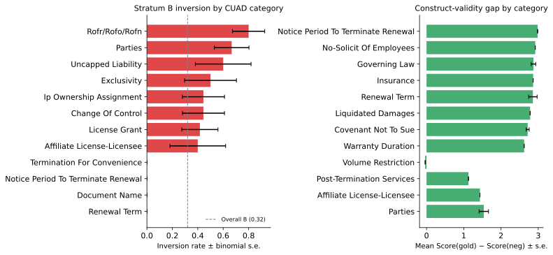

*Figure. Left: Stratum B inversion by CUAD category (± binomial s.e.; n≥3). Right: mean Score(gold)−Score(neg) by category (± s.e. across queries).*

### 4.5 Agreement and name ablation (Gate 6)

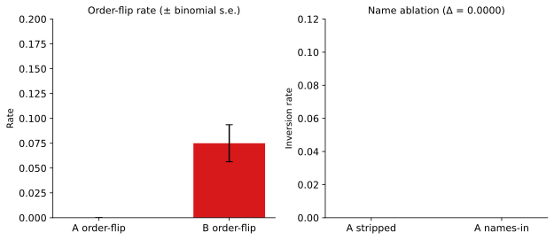

*Figure. Left: order-flip rates for Strata A and B (± binomial s.e.). Right: Stratum A inversion under stripped versus names-in text; Δ = 0.000.*

### 4.6 Cost, tokens, and latency

Total ≈ **$0.04315** over 1,542 logged calls (1,027,363 input tokens @ $0.042/MTok; output free). Overall latency mean 191.1 ms, **p50 182 ms**, p95 258 ms (concurrency 6).

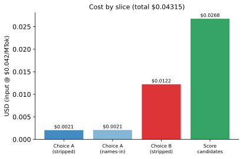

*Figure. Dollar cost by call slice at published Jev input pricing.*

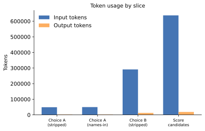

*Figure. Input and output token counts by the same slices.*

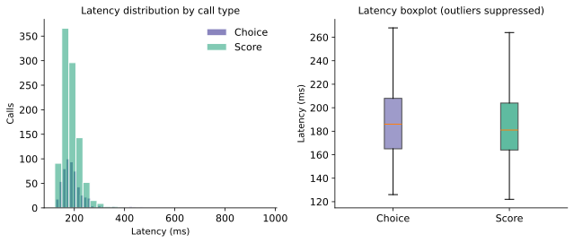

*Figure. Latency distributions for Choice versus Score calls (histogram and boxplot).*

### 4.7 Literature DeBERTa (Gate 7)

Published DeBERTa-xlarge extractive metrics (Hendrycks et al. 2021): AUPR 47.8, P@80R 44.0, P@90R 17.8. These describe **extractive** difficulty on CUAD. This bench’s task is candidate scoring / pairwise relevance; numerical comparison is narrative only. **DeBERTa is not re-run.**

## 5. Interpretation

Stratum A shows that under an easy relevance contrast, Jev Choice does not invert. Stratum B is harder: BM25-selected negatives from the same contract share topical vocabulary, and inversion rises to about 32%—consistent with a difficult discrimination setting rather than a vacuous task. Candidate Score recovers gold paragraphs far above BM25 and chance. The Gate 4 gold−neg Score gap supports construct validity of the relevance Score axis under a shared category query. Calibration on Stratum B (ECE ≈ 0.32) indicates overconfidence relative to binary gold; we report this without temperature fitting. Gate 7’s DeBERTa numbers remain a literature difficulty anchor, not a within-bench baseline.

## 6. Limitations

- Paragraph chunking is heuristic; gold spans may cross chunk boundaries (mapping via character overlap).
- BM25 hard-negatives are strong but not adversarial human negatives.
- Category descriptions are CUAD “Details” text, not independently authored rubrics.
- No Haiku comparator (by design for this run).
- ECE uses ten equal-width bins on p(gold); n=200 limits bin stability.
- Gold injection for measurable rank inflates Jev rank opportunity relative to pure retrieval; BM25 metrics use pre-injection ranks.
- Category-level inversion estimates are noisy for rare categories.

## 7. Reproducibility

```bash
python scripts/prepare_cuad.py          # requires data/raw/CUAD_v1/CUAD_v1.json
python scripts/build_gold_pairs.py      # freezes pairs; do not mutate after scoring
python score.py --concurrency 6
python score.py --only-ablation --concurrency 6
python scripts/analyze_gates.py
python scripts/plot_figures.py
python scripts/render_docs.py
```

Environment: `TYPESAFE_API_KEY`. Seed `20260920`. Cache: `runs/jev/cache/`. Diagnostics: `results/diagnostics.json`.
