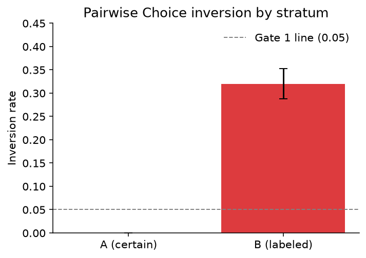
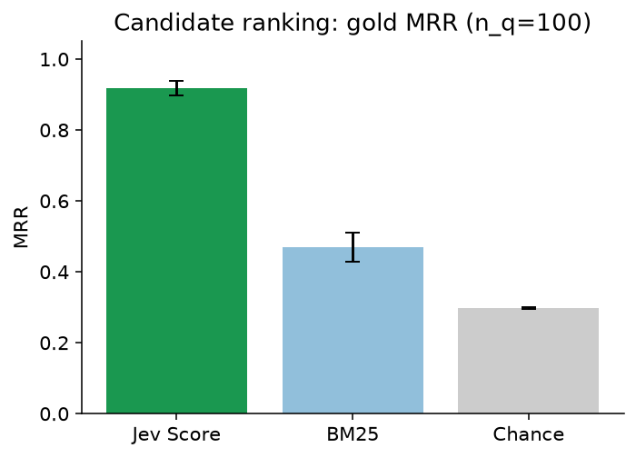
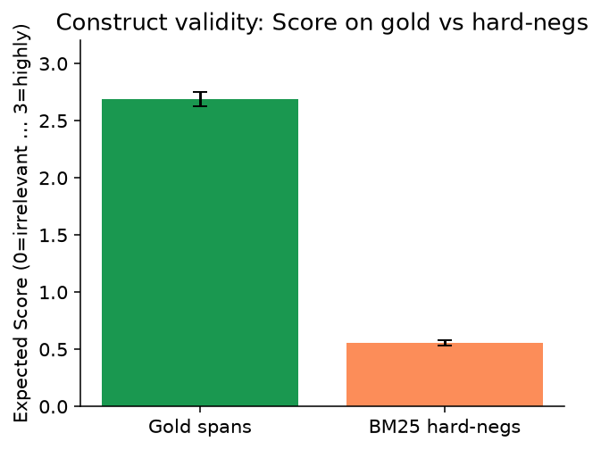
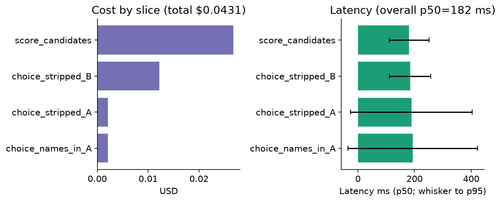

# cuad-jev-bench REPORT — pre-registered gates

**run_id:** `cuad-jev-2026-09-20`  
**criterion (exact, never paraphrase):** `more relevant to the requested contract category`  
**model:** `jev-1.13.0` (requested `jev-latest`)  
**pricing:** Jev $0.042 / MTok input; output free  
**labels:** CUAD human span annotations only — never from Jev  
**design:** Design A (Stratum A certain pairs + Stratum B labeled pairs) + candidate-score lite (Gate 3/4)

**Artifacts:** `results/gates.json` · `results/cost.json` · `results/timing.json` · `results/data_stats.json` · `results/accuracy_summary.json` · `results/baseline_literature.json`

## Abstract

This report evaluates TypeSafe/Jev judgments of contract-clause relevance on the open CUAD corpus (Atticus Project, CC BY 4.0). The measurement question is whether pairwise Choice and graded Score judgments under the frozen criterion above recover human-annotated category spans relative to hard negatives and BM25 baselines, without using the judge to construct labels. Gate 7 cites published extractive DeBERTa-xlarge numbers as a literature difficulty anchor only; this bench does not re-run DeBERTa and uses a different task shape (candidate Score vs extractive QA).

## Analysis exclusions (pre-registered)

- No post-hoc dropping of inverted Stratum A pairs.
- Gold pairs frozen in `data/pairs/gold_pairs.jsonl` before any live Jev call; mtime order documented below.
- Candidate scoring injects gold spans into BM25 top-10 when missing so rank is measurable; injection is logged, not treated as BM25 retrieval success.

## Gates (registered BEFORE any Jev output)

| # | Gate | Metric / rule | Pass line |
|---|------|---------------|-----------|
| 1 | Easy-pair inversion | Stratum A (n=40); average both presentation orders | inversion ≤ 0.05 **PASS/FAIL** |
| 2 | Labeled-pair inversion + Brier | Stratum B (n≤200); p(gold) | **report** |
| 3 | Candidate Score vs BM25 | n_q=100; gold MRR and Recall@1/@3/@5 | signal: Jev MRR > BM25 MRR |
| 4 | Construct validity | mean Score(gold spans) > mean Score(BM25 hard-negs), with STE | inequality + STE |
| 5 | Secondary calibration | Brier / ECE on Stratum B p(gold) | **report** |
| 6 | Name/meta ablation | Stratum A re-run with party names/dates left in; Δ inversion | Δ ≤ 0.05 **PASS/FAIL** |
| 7 | Literature DeBERTa baseline | Published CUAD DeBERTa-xlarge AUPR / P@R / Jaccard | **report only** — not a re-run |

## Scoring protocol

- Criterion (exact): `more relevant to the requested contract category`
- Choice (Strata A+B): Text A / Text B; meta stripped (party names, dates) for main tables; both orders; inversion on averaged winner
- Score (candidate set): levels `irrelevant / weakly relevant / relevant / highly relevant` to the category description; expected score = Σ i·p_i (0-indexed)
- Entry: `score.py` → `runs/jev/`; every answer logs tokens + `latency_ms`
- Concurrency ≈ 6; cache under `runs/jev/cache/`
- No Haiku / no Grok-as-judge on main tables

## Gold freeze checkpoint

| Event | Path | Status |
|-------|------|--------|
| Gates pre-registered | `REPORT.md` (this file) | **DONE** 2026-09-20 17:30:16 EDT (before any Jev call) |
| Gold pairs frozen | `data/pairs/gold_pairs.jsonl` | **DONE** 2026-09-20 17:32:37 EDT |
| PAIR_MANIFEST | `data/pairs/PAIR_MANIFEST.md` | **DONE** |
| Preflight cost | `results/preflight_cost.json` | **DONE** est $0.050 |
| First live Jev call | `runs/jev/answers.jsonl` | **after** gold freeze (score_start > gold mtime) |

## Results

### Gate pass/fail

| # | Gate | Result | Detail (with STE where defined) |
|---|------|--------|----------------------------------|
| 1 | Easy-pair inversion | **PASS** | 0.0000 (n=40, STE=0.0000); inverted: none |
| 2 | Labeled-pair inversion + Brier | report | inv=0.3200 STE=0.0324; Brier=0.2495 STE=0.0257; mean p(gold)=0.6757 (n=200) |
| 3 | Candidate Score vs BM25 | **PASS_SIGNAL** | Jev MRR=0.917 STE=0.021; BM25 MRR=0.469; chance=0.298; R@1/@3/@5 Jev=0.86/0.97/0.99 vs BM25=0.35/0.51/0.57 |
| 4 | Construct validity | **PASS** | gold mean Score=2.685 STE=0.062 (n=100) > neg=0.555 STE=0.027 (n=882); gap=2.130 STE=0.067 |
| 5 | Secondary Brier / ECE | report | Brier=0.2495 STE=0.0258; ECE=0.3243 (n=200) |
| 6 | Name/meta ablation | **PASS** | stripped inv=0.0000; names-in inv=0.0000; Δ=0.0000 |
| 7 | Literature DeBERTa | report | AUPR 47.8; P@80R 44.0; P@90R 17.8 (Hendrycks et al. 2021). **Not re-run.** Different task shape. |

### Inversion tables

| Stratum | n | inverted | inversion (STE) | mean p(gold) | mean Brier (STE) | order-flip |
|---------|--:|--------:|----------------:|-------------:|-----------------:|-----------:|
| A certain | 40 | 0 | 0.0000 (0.0000) | 0.9761 | 0.0065 (0.0036) | 0.0000 |
| B labeled | 200 | 64 | 0.3200 (0.0324) | 0.6757 | 0.2495 (0.0257) | 0.0750 |

Inverted A: none.

### Figures

Captions: [`results/figures/CAPTIONS.md`](results/figures/CAPTIONS.md).

### Cost and timing

| Slice | calls | cache hits | input tok | USD |
|-------|------:|-----------:|----------:|----:|
| `choice_names_in_A` | 80 | 0 | 49856 | $0.002094 |
| `choice_stripped_A` | 80 | 0 | 48928 | $0.002055 |
| `choice_stripped_B` | 400 | 2 | 291158 | $0.012229 |
| `score_candidates` | 982 | 0 | 637421 | $0.026772 |
| **total** | 1542 | 2 | 1027363 | **$0.043149** |

Overall latency: mean 191.1 ms · **p50 182 ms** · p95 258 ms.

### Model resolution

First live responses resolved `jev-latest` → **`jev-1.13.0`**.

---

*Gates were written before any Jev API call for run_id `cuad-jev-2026-09-20`.*
